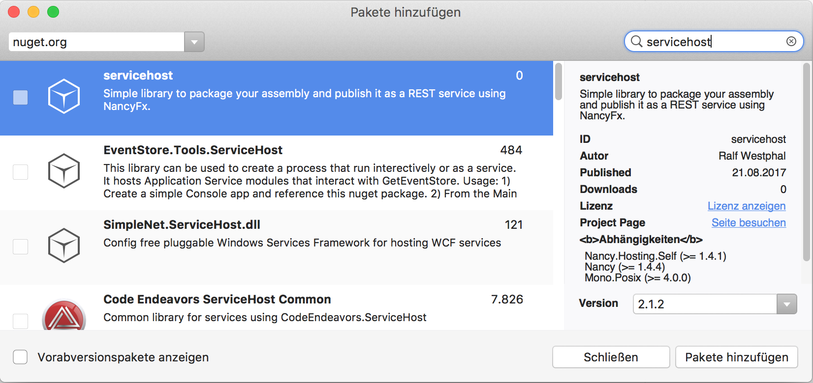
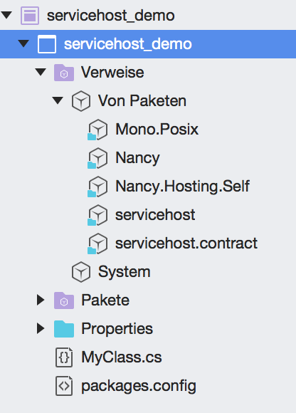

# Service Host Reference

## Add Service Host to Your Project
Service Host services are defined in .NET library projects.

To add Service Host to your project, use NuGet. Call up the NuGet manager of your choice and search for "servicehost".



Once you added the Service Host package you'll see a couple of more assemblies added to your project:



Now you're ready to define your service classes with their endpoint functions.

Note that in all service projects at least `servicehost.contract.dll` needs to be referenced. It's the home of the Service Host attributes.

## Service Definition
### [Service] Attribute
To advertize a class as a service for publication by Service Host you need to annotate it with the `[Service]` attribute and make it public:

```
using servicehost.contract;
...
[Service]
public class SimpleService {
  ...
}
```

This attribute like all the others is define in `servicehost.contract.dll`.

Upon start Service Host will check all assemblies with the extension `.dll` in the current directory for classes with this attribute and make their entrypoints accessible via HTTP.

### [EntryPoint] Attribute
The actual service to be published is a function labled with the `[EntryPoint]` attribute. There can be any number of service functions in a service class.

```
using servicehost.contract;
...
[Service]
public class SimpleService {
  [EntyPoint(HttpMethods.Get, "/echo")]
  public string Echo(string text) {
    return text;
  }
}
```

The `[EntryPoint]` attribute has two parameters:

* First you have to specify the **HTTP method** to use by clients to reach the entrypoint. Choose `HttpMethods.Get` or `HttpMethods.Post` or `HttpMethods.Put` or `HttpMethods.Delete`.
* Second you have to state the **URL route** specific to the entrypoint. Upon calling the service it has to be appended to the Service Host URI, e.g. `http://localhost:1234/add`. The routes of all entrypoints on all service classes have to be *distinct per HTTP method*.

The parameters are filled from three different sources. You don't have to specify which source to use, though, except one. Service Host will check them all for your convenience.

#### Passing parameter values by query string
The easiest way to pass in values to parameters is by appending them to the service URL.

```
// Service
[EntyPoint(HttpMethods.Get, "/add")]
public int Add(int a, int b) { ... }

...

// Call with
GET http://.../add?a=1&b=42
```

Use the names of the parameters as the names of values in the querystring. This is not case sensitive and the order is not important.

Service Host will make an effort to map the values from the URL string to the parameters' types. It recognizes primitive types like `string`, `int`, `bool`, `double`, `float`, `decimal`, `DateTime`, and also `Guid`. For other types it assumes the value to be a Json and tries to deserialize it. (Which probably is not often needed for querystring parameters.)

#### Passing parameter values by route placeholder
You also can put data into routes. This is a feature of the underlying techology NancyFx. Just wrap their name them in `{}` in the route and replace them upon calling the service with the actual value.

```
// Service
[EntyPoint(HttpMethods.Get, "/products/{productId}")]
public ProductDto LoadProduct(string id) { ... }

...

// Call with
GET http://.../products/abc1234
```

Service Host treats route placeholders like querystring parameters. For the above example that means you can change the route to `/products` and call the service with `http://.../products?id=abc1234` without any need to modify the function signature.

#### Passing a parameter value as the request payload
In case you need to call a service with more structured data you probably want to pass them in as the request payload. For Service Host to take the data from the payload instead of the querystring or the route, you need to annotate the one parameter in the function signature to be filled from the payload with `[Payload]`.

```
// Service
public class AddRequest {
    public int A { get; set; }
    public int B { get; set; }
}

[EntryPoint(HttpMethods.Post, "/add")]
public int Add([Payload]AddRequest req) {
    return req.A + req.B;
}

// Call with
POST http://.../add
Content-Type: application/json
{
	"A":3,
	"B":4
}
```

If the parameter type is `string` Service Host takes the payload at face value. For other types it attempts a Json deserialization and requires the request header `Content-Type` to be `application/json`.


#### Returning results
To return a result from your service function just give it an appropriate type - which is Json serializable.

If the return type is `string` it will be return with `Content-Type` set to `text/plain`. Otherwise it will be Json serialized and returned as `application/json`.

```
// Service
public class AddResult {
    public int Sum { get; set; }
}

[EntryPoint(HttpMethods.Post, "/addJson")]
public AddResult AddJson2([Payload]AddRequest req) {
    return new AddResult { Sum = req.A + req.B };
}

// Call with
POST http://.../add
Content-Type: application/json
{
	"A":3,
	"B":4
}

// Result
Content-Type: application/json
{
   "Sum":7
}
```

#### No parameters, no result
Service Host will also "tolerate" service functions without any parameters and/or the return type being `void`.

### [Setup] Attribute
If you want something to happen _before_ an entrypoint is called by Service Host you can provide a public method annotated with the `[Setup]` attribute. It will be run right before the entry point method.

```
using servicehost.contract;
...
[Service]
public class SimpleService {
  [Setup]
  public void Prepare() {
    ...
  }
  ...
}
```

Currently service classes are instanciated for every HTTP call. No state can be retained between calls. But any state set up by a `[Setup]` method of course is present for use by the entrypoint.

There should only be one `[Setup]` method in a service class. Service Host will work with the first it finds via reflection.

### [Teardown] Attribute
If you want something to happen _after_ an entrypoint got called by Service Host you can provide a public method annotated with the `[Teardown]` attribute. It will be run right after the entry point method.

```
using servicehost.contract;
...
[Service]
public class SimpleService {
  ...
  [Teardown]
  public void Cleanup() {
    ...
  }
}
```

Currently service classes are instanciated for every HTTP call. No state can be retained between calls. But any state set up by a `[Setup]` method of course is still present.

There should only be one `[Teardown]` method in a service class. Service Host will work with the first it finds via reflection.

### Exception Handling
Any exceptions during service execution should be handled by the service itself. Design the output data structures so that they are able to carry success as well as failure data.

However, if an exception slips through to Service Host it will be caught. It will be flagged to the client with HTTP status code 500 (internal server error). Also the exception's message will be passed back to the client in the payload of the response.

## Service Publication
### Command Line Usage
You can focus on coding just your service assembly and let the Service Host command line application do the rest. Just start Service Host like this (use of `mono` depending on your platform):

```
$ mono servicehost.exe http://localhost:1234
```

The application will search for service classes in all the `.dll`-assemblies in the current directory. Any endpoints will then be published at then URI passed as the first argument on the command line. Choose the URI to your needs.

### Library Usage (self-hosting)
If you want some more control and do the hosting in your own application you can do so, too. You just need to reference `servicehost.exe`. Then, in your code, start the Service Host like so:

```
using servicehost;
...
using(var host = new ServiceHost()) {
	host.Start(new Uri("http://localhost:1234"));
	// do what you have to do to keep the process alive
}
```

In case you cannot wrap the Service Host instance with a `using` you should call `Stop()` at the end:

```
using servicehost;
...
var host = new ServiceHost();
host.Start(new Uri("http://localhost:1234"));
...
host.Stop();
```
## Calling a Service
Calling a service hosted by Service Host is straightforward using classes from the .NET base class library. But feel free to check out [RestSharp](http://restsharp.org/) for even more convenience.

Here's how you can do it if you want to pass the input via querystring parameters:

```
// Service
using servicehost.contract;
...
[Service]
public class SimpleService {
  [EntryPoint(HttpMethods.Get, "/add")]
  public int Add(int a, int b) {
    ...
  }
}

// Client
using System.Net;
...
var cli = new WebClient();
var output = cli.DownloadString("http://localhost:1234/add?A=3&B=4");
```

`output` will contain the result, a plain `7`.

In case you want to provide the input with the HTTP payload, though, you need to pass in the data as a Json string and set the `Content-Type` header accordingly:

```
// Service
using servicehost.contract;
...
public class AddRequest {
    public int A { get; set; }
    public int B { get; set; }
}

[Service]
public class SimpleService {
    [EntryPoint(HttpMethods.Post, "/add")]
    public int Add([Payload]AddRequest req) {
        return req.A + req.B;
    }
}

// Client
var cli = new WebClient();
cli.Headers.Add("Content-Type", "application/json");
var output = cli.UploadString("http://localhost:1234/add", 
                              "{\"A\":3, \"B\":4}");
```

### Exception Handling
Any exceptions happening during service execution should be handled by your service side code gracefully and be encoded in the JSON output. Service Host does not provide any special way to carry exceptions back to the client.

However, if you fail to catch an exception Service Host will catch it and pass it back to the client as a textual payload marked with the HTTP status code 500. You might want to check for that, because the `WebClient` will throw a client side exception in that case.

```
try
{
    var cli = new WebClient();
    var output = cli.DownloadString("http://localhost:1234/add?A=3&B=4");
    ...
}
catch (WebException webex) {
    var resp = (HttpWebResponse)webex.Response;
    if (resp.StatusCode == HttpStatusCode.InternalServerError) {
      var readStream = new StreamReader(resp.GetResponseStream(), Encoding.UTF8);
      var exceptionMessage = readStream.ReadToEnd();
      ...
    }
    else
      ...
}
```

## Static Content
Service Host does not just provide access to hosted service logic but also to static content like HTML pages or images.

Static content just needs to be stored in a directory called `content` in the Service Host folder. It can be reached like so: `http://localhost:1234/content/helloworld.html`.

Check out the demo client:

* In the demo client folder start the Service Host: `mono servicehost.exe http://localhost:1234`
* Open your browser and point it to `http://localhost:1234/content/addition.html`
* Enter two numbers to add and hit the button. The page will access a service coming with the demo client at `http://localhost:1234/add` and display the result.